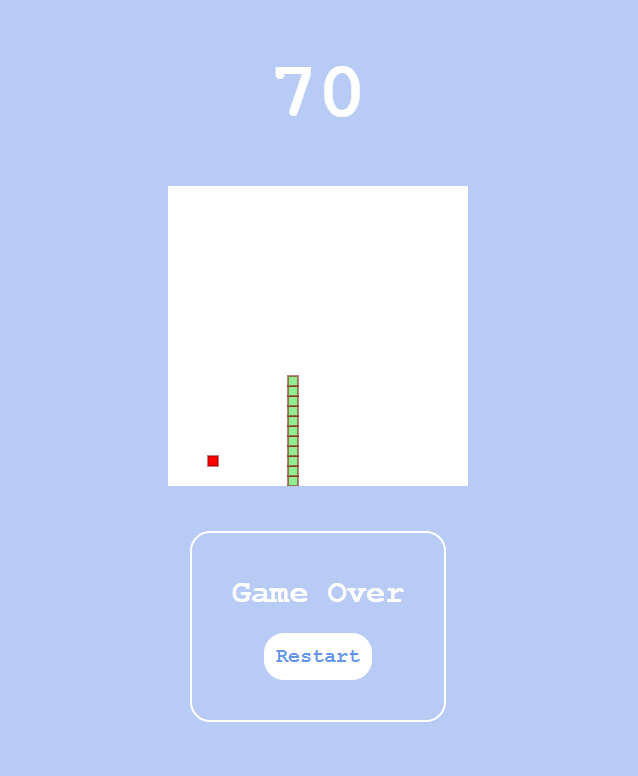

# Snake Game in Javascript

## Description

This is a simple snake game made using vanila javascript.

## How to play

- Use arrow keys to move the snake.
- Eat the food to grow the snake.
- Avoid hitting the walls and the snake itself.
- The game will end if the snake hits the wall or itself.

## Demo

Live demo: [Snake Game](https://sahil-randhawa.github.io/snake-game/)

